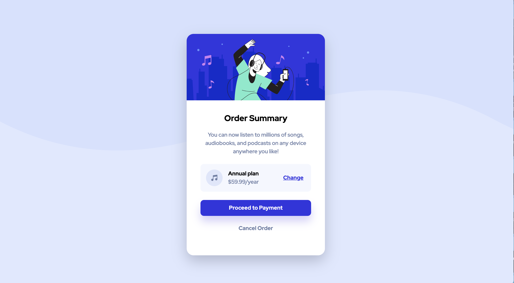
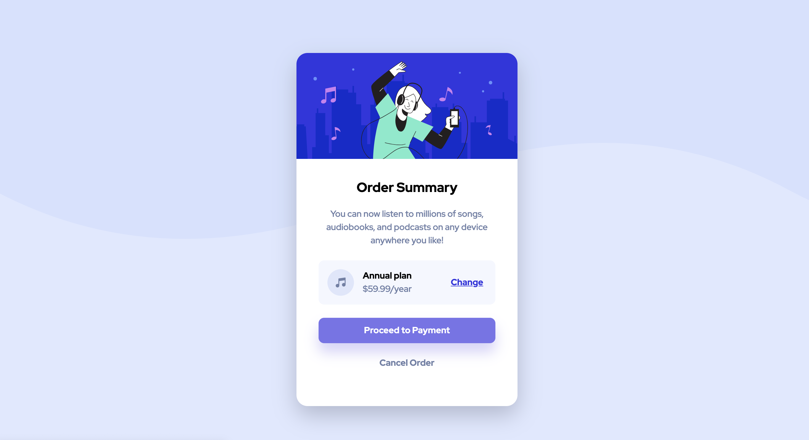

# Frontend Mentor - Order summary card solution

This is a solution to the [Order summary card challenge on Frontend Mentor](https://www.frontendmentor.io/challenges/order-summary-component-QlPmajDUj). Frontend Mentor challenges help you improve your coding skills by building realistic projects. 

## Table of contents

- [Overview](#overview)
  - [The challenge](#the-challenge)
  - [Screenshot](#screenshot)
  - [Links](#links)
- [My process](#my-process)
  - [Built with](#built-with)
  - [What I learned](#what-i-learned)
  - [Continued development](#continued-development)
  - [Useful resources](#useful-resources)
- [Acknowledgments](#acknowledgments)

## Overview

### The challenge

Users should be able to:

- See hover states for interactive elements
- View the optimal layout on their device

### Screenshots





### Links

- Live Site URL: [https://emilyw12.github.io/order-summary-component/](https://emilyw12.github.io/order-summary-component/)

## My process

### Built with

- Semantic HTML5 markup
- CSS
- Flexbox
- Mobile-first workflow

### What I learned

This was my second Frontend Mentor challenge and it helped me feel more comfortable with HTML and CSS.

Starting with the HTML: I often struggle with writing semantic HTML and understanding how to increase accessibility. I did some researching on sectioning HTML, and opted to use the ```<section>``` tag to contain the "Order Summary" section. I learned that ```<section>``` tags are used when other semantic sectioning tags aren't applicable, and should be labeled either by placing a heading tag directly after or using aria-labels. I also learned that I should use ```alt=""``` and ```aria-hidden="true"``` when using strictly decorative images, which is what I have done in my HTML. I also had some trouble differentiating when to use a button vs an anchor tag, but now my current understanding is that buttons let you perform an action, whereas anchor tags navigate you elsewhere.


Next, the CSS: I got more comfortable using Flexbox and took the time to understand the nuances behind each property I was using, instead of just using ```align-items: center``` and hoping things turn out the way I want. For example, I learned that margin-collapsing does not occur with flex items, so I needed to account for that. I also recently learned about the BEM naming convention, so I tried naming my classes in that way. Although this was not a very complex project, I thought it would be good practice to start getting used to it early.


### Continued development

I'll continue to do more HTML & CSS challenges to work on writing semantic and accessible HTML, as well as gaining more confidence on styling layout and spacing. I'd like to explore more flex properties to be able to use them fully to my advantage, and also start to learn about CSS grid.

### Useful resources

- [CSS Tricks: BEM 101](https://css-tricks.com/bem-101/) - This helped me understand the BEM naming convention and gave good examples.
- [Sparkbox: BEM By Example](https://sparkbox.com/foundry/bem_by_example) - Another BEM article with examples.
- [How to Section Your HTML](https://css-tricks.com/how-to-section-your-html/#you-need-to-label-your-sections-here-are-three-methods) - A long article on sectioning HTML that I'll be referencing more in the future, but helped me get a basic understanding of different sectioning elements and how to use them.

## Acknowledgments

Thank you to Grace on Frontend Mentor for always giving helpful feedback!
